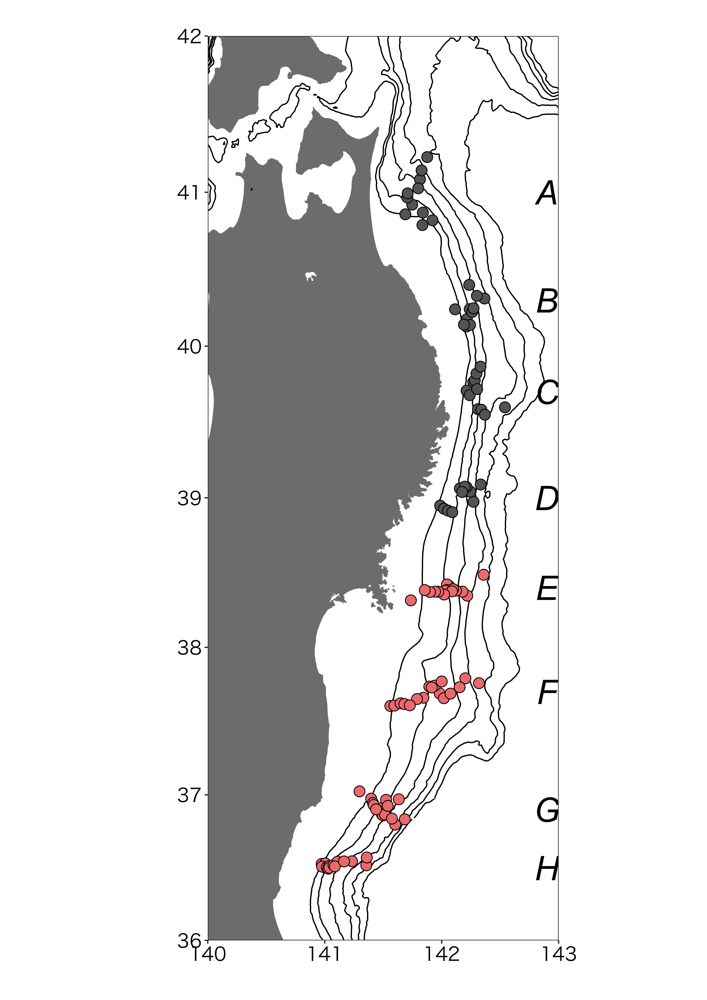
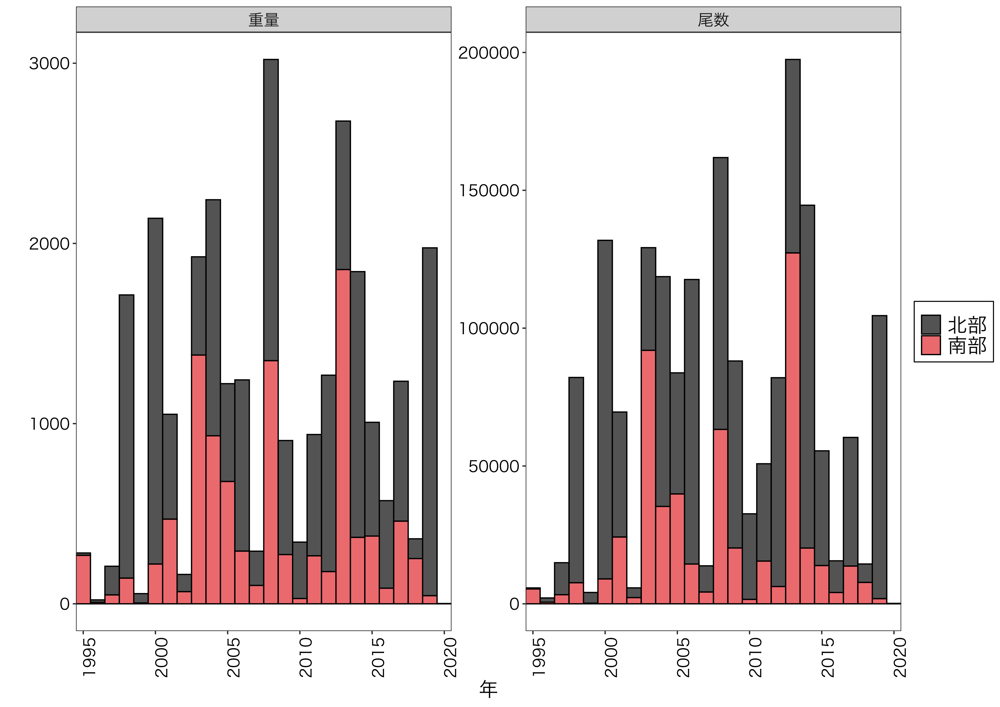
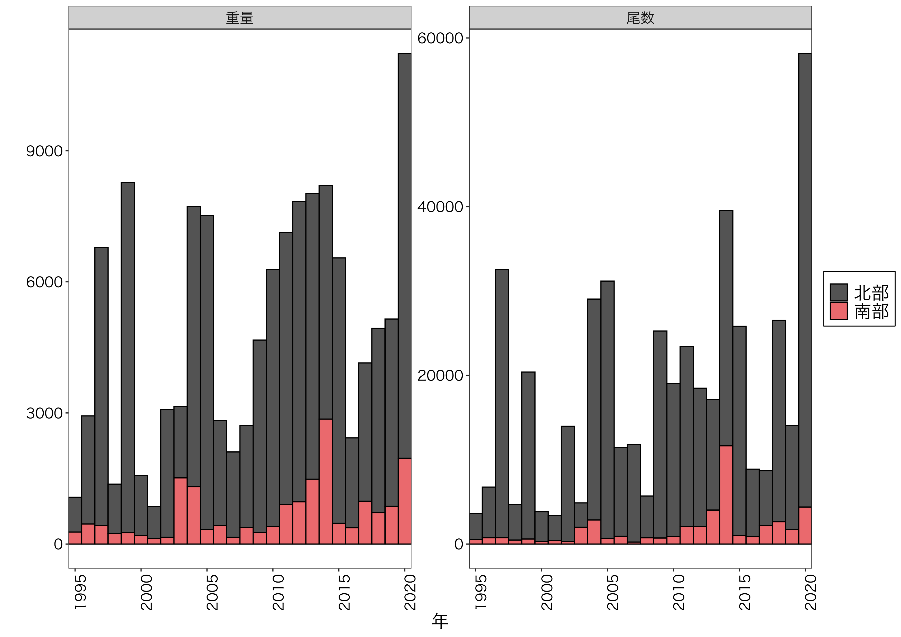
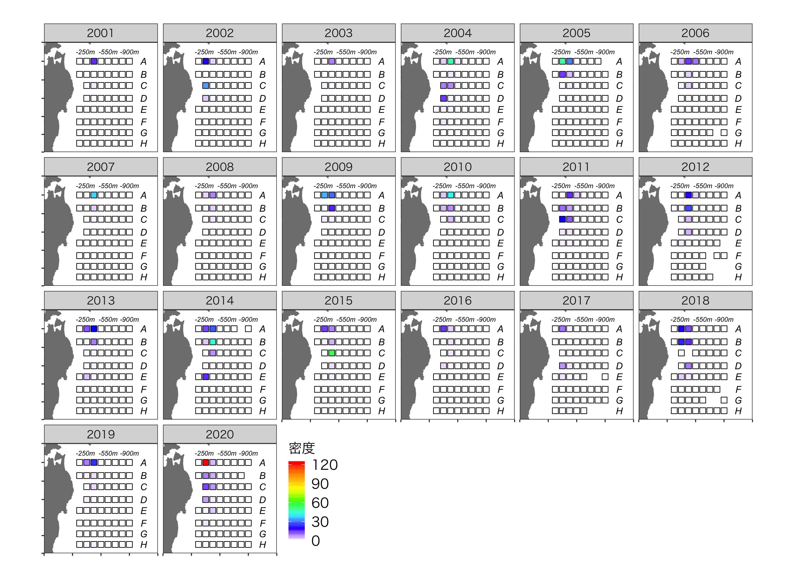
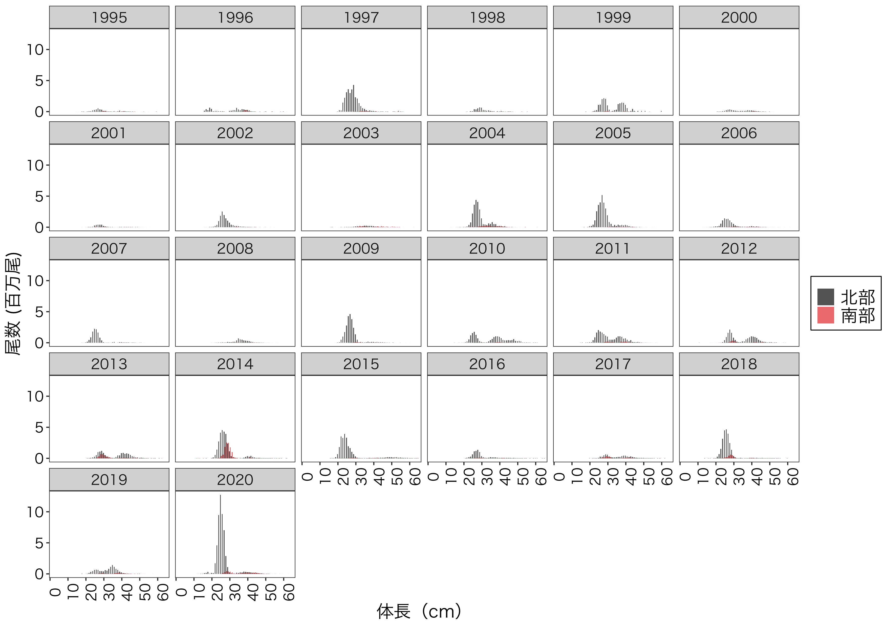

# 2020年底魚類現存量調査結果
### 金森由妃・成松庸二・鈴木勇人・森川英祐・時岡　駿・三澤　遼・永尾次郎（水産機構資源研）  
  
  
# 調査の概要
### - 日時: 2020年10月1日〜11月13日
### - 場所: 計107地点

### - 対象種: ソケトウダラ，マダラ，イトヒキダラ，キチジ，ズワイガニ，アカガレイ，アメガレイ，ババガレイ
### - 項目: 面積密度法で推定した重量・尾数（密度）・体調組成の経年変化

# スケトウダラ0歳

### 2020年は南北合計で1.7トン (17万尾)．[2019年は2,000トン (1億尾)]

# スケトウダラ1歳
  

### 2020年は南北合計で11,200トン (5,800万尾)．[2019年は5,100トン (1,400尾)]

### 20cm台の中型個体が増加
